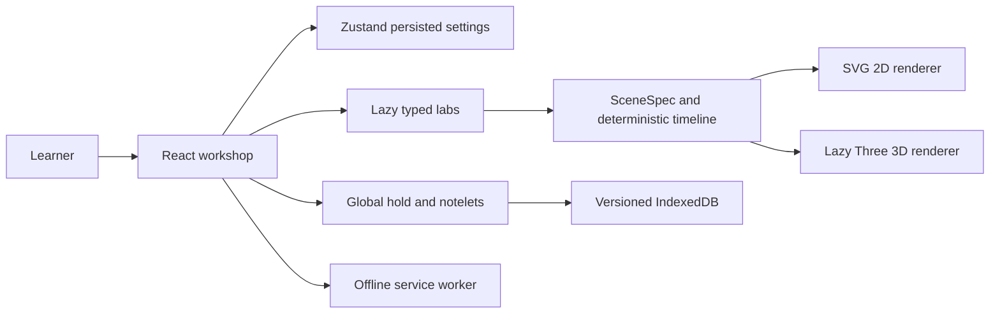

# Monomath

See it, touch it, then read it. Monomath is a local learning workshop for mathematics, logic, statistics, physics, and programming. The complete product specification is in [docs/BRIEF.md](docs/BRIEF.md); the build status is in [PLAN.md](PLAN.md).

## Run

Node 22 or newer is recommended. On Windows, macOS, or Linux:

```sh
npm install
npm run dev
```

Open the URL printed by Vite. `npm run check` runs strict TypeScript, ESLint, unit tests, and the production build. `npm run e2e` runs Chromium desktop and mobile profiles after `npx playwright install chromium`. Use `npm run build` and `npm run preview` to verify the offline production app; the development server deliberately has no service worker.

The app has no accounts, analytics, server, AI calls, or runtime CDN requests. Fonts are bundled. Settings and progress stay on your device. PWA installability requires HTTPS or localhost.

Open **Fractions lab** for exact worked operations, three representations, predictions, scene-based proofs and a three-part Boss. The welcome Workshop keeps a short interactive introduction.

**Sets lab** explores finite membership, sieves, power sets and relations. **Truth Lanterns** turns propositional formulas and arguments into exact truth tables, wired gates and Venn truth sets. Its proof challenges check the worlds you mark; arguments search for concrete counter-worlds. Both labs include predictions, three explanation depths, alternate methods, Echoes and saved study context.

The **Equation workspace** draws supported real curves, implicit planar relations, height surfaces and constant values. It includes parameter controls, viewport movement, point inspection, numerical slopes, tables and surface slices. General implicit 3D surfaces, arbitrary programs, inequalities and symbolic calculus are currently unsupported; the UI explains input limits. Discontinuities create gaps rather than false connecting strokes.

**Philosophy** is your lesson authoring space: write Markdown, save drafts, read, search, add private reflections, and export/import lessons. Browser-authored lessons stay on that device. To include them in your GitHub deployment, export them and follow `src/content/philosophy/README.md` to put them in the source lesson list. Private reflections are excluded from lesson exports.

## Deploy

`npm run build` produces static files in `dist/`. Routes use hash navigation, which works on Vercel, Netlify, and GitHub Pages without a rewrite. Vercel: build command `npm run build`, output `dist`. Netlify: the included netlify.toml sets the same values. GitHub Pages: upload the contents of dist; relative asset paths support a repository subdirectory.

## Architecture

For GitHub, push the repository including `package-lock.json` and `.github/workflows`. In repository Settings → Pages, choose **GitHub Actions**. The included Pages workflow runs the quality gate and publishes `dist/` on pushes to `main` or `master`, or by manual dispatch. `node_modules`, generated builds, test reports and environment files are ignored. Keep local progress and notelet export files somewhere private if they contain personal study notes.

Your GitHub repository name can be anything: Vite uses relative assets and the app uses hash routes. You can also keep Pages disabled and use the source repository without publishing.



See docs/DESIGN.md for the visual grammar and docs/QA_PLAN.md for acceptance coverage. Unfinished labs stay locked. Creator: Airator.
