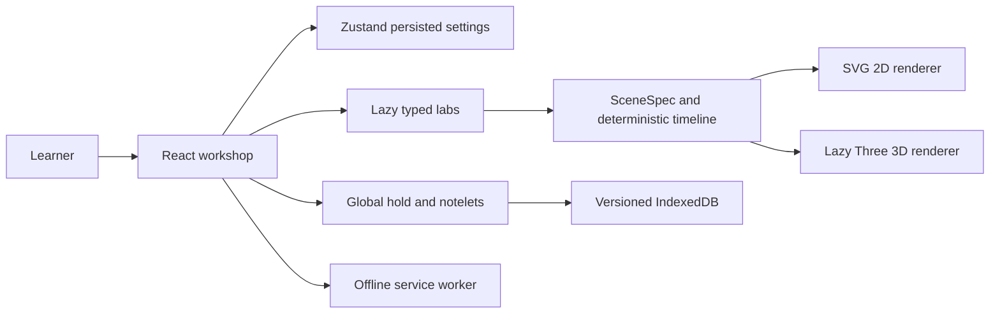

# Monomath

See it, touch it, then read it. Monomath is a local learning workshop for mathematics, logic, statistics, physics, and programming. The complete product specification is in [docs/BRIEF.md](docs/BRIEF.md); the build status is in [PLAN.md](PLAN.md).

## Run

Node 22 or newer is recommended. On Windows, macOS, or Linux:

```sh
npm install
npm run dev
```

Open the URL printed by Vite. `npm run check` runs strict TypeScript, ESLint, unit tests, and the production build. `npm run e2e` runs Chromium desktop and mobile profiles after `npx playwright install chromium`. Use `npm run build` and `npm run preview` to verify the offline production app; the development server deliberately has no service worker.

The app has no accounts, analytics, server, AI calls, or runtime CDN requests. Fonts are bundled. Settings and progress stay on your device. PWA installability requires HTTPS or localhost.

## Deploy

`npm run build` produces static files in `dist/`. Routes use hash navigation, which works on Vercel, Netlify, and GitHub Pages without a rewrite. Vercel: build command `npm run build`, output `dist`. Netlify: the included netlify.toml sets the same values. GitHub Pages: upload the contents of dist; relative asset paths support a repository subdirectory.

## Architecture



See docs/DESIGN.md for the visual grammar and docs/QA_PLAN.md for acceptance coverage. Unfinished labs stay locked. Creator: Airator.
